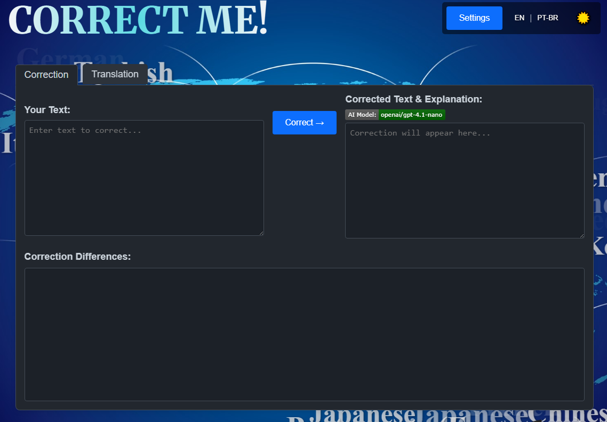

# CorrectMe Web

 &nbsp;
 &nbsp;
  
</a>

This is a free, AI-powered tool for **text correction** and **translation**.  
This app uses free models from [OpenRouter](https://openrouter.ai). All you have to do is get an OpenRouter API key, configure it in the settings, and choose a free model.  
(This app is a web version of my [CorrectMe](https://github.com/fabiojbg/Correct-Me) Windows application)

## Features

*   **Text Correction:** Get your text corrected by an AI, complete with explanations for the changes and a visual diff highlighting the modifications.
*   **Text Translation:** Translate text into various target languages.
*   **Language Detection:** Automatically detects the language of the input text for more accurate corrections.
*   **Internationalized UI:** The user interface is available in English and Portuguese (Brazil).
*   **Theme Toggle:** Switch between Light and Dark themes for comfortable viewing.
*   **Local API Key Storage:** Securely store your LLM API key locally in your browser via the Settings modal.
*   **OpenRouter Free Model Selection:** Choose from a list of available free models provided by OpenRouter.ai directly within the Settings modal.
*   **Streaming Responses:** Corrections are streamed back for a more responsive experience.

## How it Works

CorrectMe Web provides a simple interface for text manipulation:

1.  Enter your text into the appropriate text area (Correction or Translation tab).
2.  For corrections, click the "Correct" button. The app detects the language, sends the text to the configured LLM API (via OpenRouter.ai by default), streams the corrected text and explanations back, and displays a visual difference using `htmldiff.js`.
3.  For translations, select the target language and click "Translate". The app sends the text and target language to the selected LLM API model and displays the translation.
4.  A settings modal allows you to enter and save your OpenRouter API key and select your preferred free model. Both are necessary for the AI features to function and are stored only in your browser's `localStorage`.

## Technology Stack

*   HTML5
*   CSS3
*   Vanilla JavaScript (ES6+)
*   [htmldiff.js](https://github.com/tnwinc/htmldiff.js) (included locally) - For visualizing text differences.
*   [OpenRouter.ai API](https://openrouter.ai/) (or potentially other LLM providers) - For the AI correction and translation capabilities.

## Setup & Usage

1.  Clone this repository or download the files.
2.  Open the `index.html` file directly in your web browser.
3.  **Important:** Click the "Settings" button. Enter your OpenRouter.ai API key and select one of the available free models from the dropdown. The correction and translation features will not work without a valid API key and a selected model. These settings are saved locally in your browser's storage for future sessions.
4.  Start correcting or translating text!

## Localization

The user interface supports multiple languages. Translation files are located in the `locales/` directory:

*   `locales/en.json`: English
*   `locales/pt-BR.json`: Portuguese (Brazil)

The application detects the browser's preferred language or uses the language selected via the UI buttons/localStorage.
